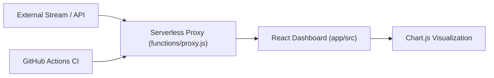

# Real-Time Data Streaming Dashboard
Data-integration portfolio project aligned to ANZSCO 261312 (Developer Programmer).

## Problem
Real-time products must ingest high-frequency external data, update UI responsively, and protect upstream APIs with controlled request patterns.

## Solution
This repository demonstrates a streaming dashboard pattern:
- WebSocket-driven frontend updates with chart visualization,
- serverless proxy layer with rate-limiting behavior,
- normalized payload handling and clear failure responses,
- automated unit/integration tests for proxy behavior.

## Architecture Diagram

## Tech Stack
- React + TypeScript
- WebSockets
- Chart.js
- Serverless function pattern
- GitHub Actions

## Setup Instructions
1. `cd app && npm install`
2. Run checks and tests: `npm run check && npm test`
3. Connect UI scaffold to your preferred runtime (Vite/Next/SvelteKit).
4. Deploy `functions/proxy.js` to your serverless provider.

## Testing
- Unit tests (rate limiter behavior):
  - `app/test/proxy.unit.test.js`
- Integration-style tests (proxy handler response flow):
  - `app/test/proxy.integration.test.js`
- Run all tests:
  - `cd app && npm test`

## ANZSCO 261312 Competency Evidence
- **Software development for event-driven systems**: real-time flow handling in `app/src/Dashboard.tsx`.
- **Systems integration**: proxy orchestration and upstream normalization in `functions/proxy.js`.
- **Testing and debugging**: unit + integration-style test coverage in `app/test/`.
- **Operational quality**: CI checks and test automation in `.github/workflows/ci.yml`.

## Commit Convention
Use Conventional Commits:
- `feat(stream): add reconnection backoff strategy`
- `fix(proxy): return consistent error payload for upstream failures`
- `test(proxy): add rate-limiter reset window test`
- `docs(readme): add architecture diagram and setup steps`

## Evidence Map
- Dashboard logic: `app/src/Dashboard.tsx`
- Proxy implementation: `functions/proxy.js`
- Tests: `app/test/`
- CI pipeline: `.github/workflows/ci.yml`
